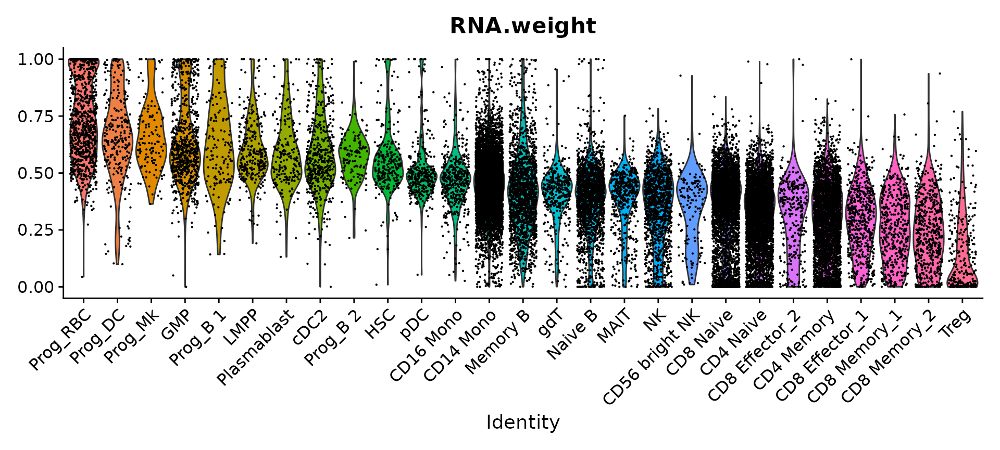

# scMultiome
## 从单细胞转录组走向多组学研究

## 3端单细胞全长免疫组库测序

## 单细胞TCR测序研究PD-1治疗前后T细胞克隆型变化

## 单细胞BCR测序寻找新冠肺炎中和抗体

## 单细胞靶向捕获突破3‘端的限制

单细胞靶向捕获：定制化的引物序列（替代polyA尾巴）进而特性行的捕获到想要研究的基因的基因突变和融合信息。
## 应用示例：肿瘤细胞肺癌驱动基因状态

肺癌相关的驱动基因的上下游引物设计成一个panel，通过这个panel可以检测基因突变的状态和mRNA全转录组的信息
## 单细胞转录组综合指标分数可预测治疗疗效

## 结合药物信息解读测序结果，辅助指定用药方案

## 单细胞动态转录组技术增加时间纬度


## 2 Workflow
### 2.1 Cell Ranger ARC

```Cell Ranger ARC``` is a set of analysis pipelines that process Chromium Single Cell Multiome ATAC + Gene Expression sequencing data to generate a variety of analyses pertaining to gene expression, chromatin accessibility and their linkage. Furthermore, since the ATAC and gene expression measurements are on the very same cell, we are able to perform analyses that link chromatin accessibility and gene expression.

```cellranger-arc mkfastq``` demultiplexes raw base call (BCL) files generated by Illumina sequencers into FASTQ files. It is a wrapper around Illumina's bcl2fastq, with additional useful features that are specific to 10x libraries and a simplified sample sheet format. The same command can be used to demultiplex both ATAC and GEX flow cells.

```cellranger-arc count``` takes FASTQ files from cellranger-arc mkfastq and performs alignment, filtering, barcode counting, peak calling and counting of both ATAC and GEX molecules. Furthermore, it uses the Chromium cellular barcodes to generate feature-barcode matrices, perform dimensionality reduction, determine clusters, perform differential analysis on clusters and identify linkages between peaks and genes. The count pipeline can take input from multiple sequencing runs on the same GEM well.

```cellranger-arc aggr``` aggregates and analyzes the outputs from multiple runs of cellranger-arc count (such as from multiple samples from one experiment). Features include normalization of input runs to same median fragments per cell (sensitivity), detection of accessible chromatin peaks, count matrix generation for peaks and transcription factors for the aggregate data, dimensionality reduction, cell clustering, and cluster differential accessibility analysis.

```cellranger-arc``` reanalyze takes the analysis files produced by cellranger-arc count or cellranger-arc aggr and reruns secondary analysis. Features include tunable parameter settings related to cell calling, dimensionality reduction, cell clustering, and cluster differential accessibility analysis.

These pipelines combine Chromium-specific algorithms with the widely used aligners STAR and BWA. Output is delivered in standard BAM, MEX, CSV, HDF5 and HTML formats that are augmented with cellular information and a .cloupe file for use with Loupe Browser.


**Workflows**

If you are beginning with raw base call (BCL) files, the Cell Ranger ARC workflow starts with demultiplexing the BCL files for each flow cell directory for all relevant ATAC and GEX sequencing runs. 10x recommends using cellranger-arc mkfastq as described in Generating FASTQs. If you are beginning with FASTQ files that have already been demultiplexed with bcl2fastq directly, or from a public source such as SRA, you can skip cellranger-arc mkfastq and begin with cellranger-arc count. Please see the Specifying Input FASTQs page for specific guidelines on which arguments to use for your scenario.

The exact steps of the workflow vary depending on how many samples, GEM wells, and flow cells you have. This section describes the simplest possible workflows.

**One Sample, One GEM Well, One ATAC + One GEX Flow cell**


In this example you have one sample that is processed through one GEM well (a set of partitioned cells from a single 10x Chromium™ Chip channel) and results in one Multiome ATAC library and one Multiome GEX library. Each library is sequenced separately on one flow cell. In this case you would generate FASTQs separately for ATAC and GEX by running cellranger-arc mkfastq on the respective flow cells and run cellranger-arc count as described in Single-Sample Analysis.

**One Sample, One GEM well, Multiple ATAC + Multiple GEX Flow cells**


In this example you have one sample that is processed through one GEM well resulting in one ATAC library and one GEX library. The ATAC and GEX libraries are sequenced on two flow cells each. As an example, this may be done to increase sequencing depth, when the first sequencing run did not produce enough raw read pairs per cell. Here we would run cellranger-arc mkfastq a total of four times: once for each of the two ATAC flow cells and once for each of the two GEX flow cells. All of the reads can be combined in a single instance of the cellranger-arc count pipeline. This process is described in Specifying Input Fastqs.

**Single-Library Analysis with Cell Ranger ARC**
Cell Ranger ARC's pipelines analyze sequencing data produced from Chromium Single Cell Multiome ATAC + Gene Expression. The analysis involves the following steps:

Run cellranger-arc mkfastq on the Illumina BCL output folder for each ATAC (GEX resp.) flow cell to generate ATAC (GEX resp.) FASTQ data. Note that a separate run of mkfastq is required for each ATAC and each GEX flow cell.

Run a separate instance of cellranger-arc count for each GEM well that was demultiplexed by the cellranger-arc mkfastq in the previous step.

For the following example, assume that one sample is processed using Single Cell Multiome ATAC + Gene Expression to generate a Multiome ATAC library and a Multiome Gene Expression (GEX) library. The Multiome ATAC library is sequenced on flow cell HNATACSQXX and the Illumina BCL output is located in /sequencing/Sample_ATAC_HNATACSQXX; similarly, the Multiome GEX library is sequenced on flow cell HNGEXSQXXX and the Illumina BCL output is located in /sequencing/Sample_GEX_HNGEXSQXXX.

Run cellranger-arc mkfastq
Follow the instructions on running cellranger-arc mkfastq to generate FASTQ files for both the ATAC and GEX flow cells. cellranger-arc mkfastq will create output ATAC FASTQ files in HNATACSQXX/outs/fastq_path and GEX FASTQ files in HNGEXSQXXX/outs/fastq_path.

Download or create a cellranger-arc-compatible reference
Reference packages for human (GRCh38) and mouse (mm10) compatible with Cell Ranger ARC are available for download. You can also create a reference package using cellranger-arc mkref starting with a genome assembly FASTA file, a GTF file of gene annotations, and optionally a file of transcription factor motifs in JASPAR format.

Create a libraries CSV file
Construct a 3-column libraries CSV file that specifies the location of the ATAC and GEX FASTQ files associated with the sample.


Column Name	Description
fastqs	A fully qualified path to the directory containing the demultiplexed FASTQ files for this sample. This field does not accept comma-delimited paths. If you have multiple sets of fastqs for this library, add an additional row, and use the use same library_type value.
sample	Sample name assigned in the bcl2fastq sample sheet.
library_type	This field is case-sensitive and must exactly match Chromatin Accessibility for a Multiome ATAC library and Gene Expression for a Multiome GEX library.
For our example, the file would look as follows:

fastqs,sample,library_type
/home/jdoe/runs/HNGEXSQXXX/outs/fastq_path,example,Gene Expression
/home/jdoe/runs/HNATACSQXX/outs/fastq_path,example,Chromatin Accessibility
The CSV contains two rows as all the sequencing data for ATAC (GEX resp.) were obtained from one flow cell. The library_type is restricted to be either Gene Expression or Chromatin Accessibility.
Run cellranger-arc count
To generate single cell feature counts and secondary analyses for a single library, run cellranger-arc count with the following arguments. For a complete listing of the arguments accepted, see the Command Line Argument Reference below, or run cellranger-arc count --help.

For help on which arguments to use to target a particular set of FASTQs, consult Specifying Input FASTQ Files for 10x Pipelines.
After determining these input arguments, run cellranger-arc:
```shell
 cd /home/jdoe/runs
 cellranger-arc count --id=sample345 \
                       --reference=/opt/refdata-cellranger-arc-GRCh38-2020-A-2.0.0 \
                       --libraries=/home/jdoe/runs/libraries.csv \
                       --localcores=16 \
                       --localmem=64
```
Following a series of checks to validate input arguments, cellranger-arc count pipeline stages will begin to run:

Martian Runtime - v4.0.5
 
Running preflight checks (please wait)...
Checking FASTQ folder...
Checking reference...
Checking reference_path (/opt/refdata-cellranger-arc-GRCh38-2020-A-2.0.0) on compute-server32...
Checking chemistry...
Checking optional arguments...
...

By default, cellranger-arc will use all the cores available on your system to execute pipeline stages. You can specify a different number of cores to use with the --localcores option; for example, --localcores=16 will limit cellranger-arc to using up to sixteen cores at once. Similarly, --localmem will restrict the amount of memory (in GB) used by cellranger-arc.

The pipeline will create a new folder named with the sample ID you specified (e.g. /home/jdoe/runs/sample345) for its output. If this folder already exists, cellranger-arc will assume it is an existing pipestance and attempt to resume running it.


Output Files
A successful cellranger-arc count run should conclude with a message similar to this:

Outputs:
- Secondary analysis outputs:
    clustering:
      atac: {
        ...
      }
      gex:  {
        ...
      }
    dimensionality_reduction:
      atac: {
        ...
      }
      gex:  {
        ...
      }
    feature_linkage:
      ...
    tf_analysis:
      ...
- Run summary HTML:                              /home/jdoe/runs/sample345/outs/web_summary.html
- Run summary metrics CSV:                       /home/jdoe/runs/sample345/outs/summary.csv
- Per barcode summary metrics:                   /home/jdoe/runs/sample345/outs/per_barcode_metrics.csv
- Filtered feature barcode matrix MEX:           /home/jdoe/runs/sample345/outs/filtered_feature_bc_matrix
- Filtered feature barcode matrix HDF5:          /home/jdoe/runs/sample345/outs/filtered_feature_bc_matrix.h5
- Raw feature barcode matrix MEX:                /home/jdoe/runs/sample345/outs/raw_feature_bc_matrix
- Raw feature barcode matrix HDF5:               /home/jdoe/runs/sample345/outs/raw_feature_bc_matrix.h5
- Loupe browser visualization file:              /home/jdoe/runs/sample345/outs/cloupe.cloupe
- GEX Position-sorted alignments BAM:            /home/jdoe/runs/sample345/outs/gex_possorted_bam.bam
- GEX Position-sorted alignments BAM index:      /home/jdoe/runs/sample345/outs/gex_possorted_bam.bam.bai
- GEX Per molecule information file:             /home/jdoe/runs/sample345/outs/gex_molecule_info.h5
- ATAC Position-sorted alignments BAM:           /home/jdoe/runs/sample345/outs/atac_possorted_bam.bam
- ATAC Position-sorted alignments BAM index:     /home/jdoe/runs/sample345/outs/atac_possorted_bam.bam.bai
- ATAC Per fragment information file:            /home/jdoe/runs/sample345/outs/atac_fragments.tsv.gz
- ATAC Per fragment information index:           /home/jdoe/runs/sample345/outs/atac_fragments.tsv.gz.tbi
- ATAC peak locations:                           /home/jdoe/runs/sample345/outs/atac_peaks.bed
- ATAC smoothed transposition site track:        /home/jdoe/runs/sample345/outs/atac_cut_sites.bigwig
- ATAC peak annotations based on proximal genes: /home/jdoe/runs/sample345/outs/atac_peak_annotation.tsv
 
Waiting 6 seconds for UI to do final refresh.
Pipestance completed successfully!
 
yyyy-mm-dd hh:mm:ss Shutting down.
 
Saving pipestance info to "sample345/sample345.mri.tgz"
The output of the pipeline will be contained in a folder named with the sample ID you specified (e.g. sample345). The subfolder named outs will contain the main pipeline output files:

File Name	Description
web_summary.html	Run summary metrics and charts in HTML format.
summary.csv	Run summary metrics in CSV format.
raw_feature_bc_matrix.h5	Raw feature barcode matrix stored as a CSC sparse matrix in hdf5 format. The rows consist of all the gene and peak features concatenated together and the columns consist of all observed barcodes with non-zero signal for either ATAC or gene expression.
raw_feature_bc_matrix	Raw feature barcode matrix stored as a CSC sparse matrix in MEX format. The rows consist of all the gene and peak features concatenated together and the columns consist of all observed barcodes with non-zero signal for either ATAC or gene expression.
per_barcode_metrics.csv	ATAC and GEX read count summaries generated for every barcode observed in the experiment. For more details see Per-barcode metrics.
gex_possorted_bam.bam	GEX reads aligned to the genome and transcriptome annotated with barcode information in BAM format.
gex_possorted_bam.bam.bai	Index for gex_possorted_bam.bam.
gex_molecule_info.h5	Count and barcode information for every GEX molecule observed in the experiment in hdf5 format.
filtered_feature_bc_matrix.h5	Filtered feature barcode matrix stored as a CSC sparse matrix in hdf5 format. The rows consist of all the gene and peak features concatenated together (identical to raw feature barcode matrix) and the columns are restricted to those barcodes that are identified as cells.
filtered_feature_bc_matrix	Filtered feature barcode matrix stored as a CSC sparse matrix in MEX format. The rows consist of all the gene and peak features concatenated together (identical to raw feature barcode matrix) and the columns are restricted to those barcodes that are identified as cells.
cloupe.cloupe	Loupe Browser visualization file with all the analysis outputs.
atac_possorted_bam.bam.bai	ATAC reads aligned to the genome annotated with barcode information in BAM format.
atac_possorted_bam.bam	Index for atac_possorted_bam.bam.
atac_peaks.bed	Locations of open-chromatin regions identified in this sample. These regions are referred to as "peaks".
atac_peak_annotation.tsv	Annotations of peaks based on genomic proximity alone. Note that these are not functional annotations and they do not make use of linkage with GEX data.
atac_fragments.tsv.gz	Count and barcode information for every ATAC fragment observed in the experiment in TSV format.
atac_fragments.tsv.gz.tbi	Index for atac_fragments.tsv.gz.
atac_cut_sites.bigwig	Genome track of observed transposition sites in the experiment smoothed at a resolution of 400 bases in BIGWIG format.
analysis	Various secondary analyses that utilize the ATAC data, the GEX data, and their linkage: dimensionality reduction and clustering results for the ATAC and GEX data, differential expression, and differential accessibility for all clustering results above and linkage between ATAC and GEX data. See Analysis Overview for more information.
Once cellranger-arc count has successfully completed, you can browse the resulting summary HTML file in any supported web browser, open the .cloupe file in Loupe Browser, or refer to the Understanding Output section to explore the data manually.


Command-Line Argument Reference
These are the required command line arguments (also available through cellranger-arc aggr --help):

Argument	Description
--id	A unique run ID string that must consist solely of letter, number, hyphen (-), or underscore (_) characters and be at most 64 characters long. This is the name of the directory that contains all the pipeline-generated files and outputs.
--libraries	Path to a 3-column CSV file declaring FASTQ paths, sample names and library types of input ATAC and GEX FASTQs. The libraries CSV format is described here.
--reference	Path to the cellranger-arc-compatible reference package. References for human and mouse are available for download. Custom references can be constructed as described here.
Additional optional parameters are available:

Argument	Description
--description	Sample description to embed into output files
--gex-exclude-introns	Disable counting of intronic reads. In this mode we only count reads that are exonic and compatible with annotated splice junctions in the reference. Note: using this mode will reduce the UMI counts in the count matrix.
--min-atac-count	Cell caller override: define the minimum number of ATAC transposition events in peaks (ATAC counts) for a cell barcode. Note: this option must be specified in conjunction with `min-gex-count`. With `--min-atac-count=X` and `--min-gex-count=Y` a barcode is defined as a cell if it contains at least X ATAC counts AND at least Y GEX UMI counts. It is advisable to use these parameters only after reviewing the web summary generated using default parameters.
--min-gex-count	Cell caller override: define the minimum number of GEX UMI counts for a cell barcode. Note: this option must be specified in conjunction with `min-atac-count`. With `--min- atac-count=X` and `--min-gex-count=Y` a barcode is defined as a cell if it contains at least X ATAC counts AND at least Y GEX UMI counts. It is advisable to use these parameters only after reviewing the web summary generated using default parameters.
--peaks	Peak-caller override: specify peaks to use in downstream analyses from supplied BED file. Note that the file must only contain three columns specifying the contig, start, and end of the peaks. The peaks must not overlap each other. The file must be sorted by position with the same chromosome order as the reference package. The file is allowed to contain comment lines beginning with `#`.
--localcores	Restricts cellranger-arc to use specified number of cores to execute pipeline stages. By default, cellranger-arc will use all of the cores available on your system.
--localmem	Restricts cellranger-arc to use specified amount of memory (in GB) to execute pipeline stages. By default, cellranger-arc will use 90% of the memory available on your system.

### 2.2 WNN analysis of 10x Multiome, RNA + ATAC  (Seurat)
```Seurat4``` was used to analyze paired single cell transcriptome and ATAC-seq. 

- 1. Create a multimodal Seurat object with paired transcriptome and ATAC-seq profiles
- 2. Perform weighted neighbor clustering on RNA+ATAC data in single cells
- 3. Leverage both modalities to identify putative regulators of different cell types and states

The dataset from the 10x Genomics website were used for data analysis (https://support.10xgenomics.com/single-cell-multiome-atac-gex/datasets/1.0.0/pbmc_granulocyte_sorted_10k?). 

	Filtered feature barcode matrix (HDF5)
	ATAC Per fragment information file (TSV.GZ)
	ATAC Per fragment information index (TSV.GZ index)

The following packages were installed:

```Seurat v4```
```Signac``` for the analysis of single-cell chromatin datasets
```EnsDb.Hsapiens.v86``` for a set of annotations for hg38
```dplyr``` to help manipulate data tables

```R
library(Seurat)
library(Signac)
library(EnsDb.Hsapiens.v86)
library(dplyr)
library(ggplot2)
```

I created a Seurat object based on the gene expression data, and then added in the ATAC-seq data as a second assay. I explored the Signac getting started vignette for more information on the creation and processing of a ChromatinAssay object.
```R
# the 10x hdf5 file contains both data types. 
inputdata.10x <- Read10X_h5("./data/pbmc_granulocyte_sorted_10k_filtered_feature_bc_matrix.h5")

# extract RNA and ATAC data
rna_counts <- inputdata.10x$`Gene Expression`
atac_counts <- inputdata.10x$Peaks

# Create Seurat object
pbmc <- CreateSeuratObject(counts = rna_counts)
pbmc[["percent.mt"]] <- PercentageFeatureSet(pbmc, pattern = "^MT-")

# Add in the ATAC-seq data
# Peaks in standard chromosomes were used for analysis
grange.counts <- StringToGRanges(rownames(atac_counts), sep = c(":", "-"))
grange.use <- seqnames(grange.counts) %in% standardChromosomes(grange.counts)
atac_counts <- atac_counts[as.vector(grange.use), ]
annotations <- GetGRangesFromEnsDb(ensdb = EnsDb.Hsapiens.v86)
seqlevelsStyle(annotations) <- 'UCSC'
genome(annotations) <- "hg38"

frag.file <- "./data/pbmc_granulocyte_sorted_10k_atac_fragments.tsv.gz"
chrom_assay <- CreateChromatinAssay(
   counts = atac_counts,
   sep = c(":", "-"),
   genome = 'hg38',
   fragments = frag.file,
   min.cells = 10,
   annotation = annotations
 )
pbmc[["ATAC"]] <- chrom_assay
```

I performed basic QC based on the number of detected molecules (5000<ATAC<70000, 
) for each modality as well as mitochondrial percentage (less than 20%). 

```R
VlnPlot(pbmc, features = c("nCount_ATAC", "nCount_RNA","percent.mt"), ncol = 3,
  log = TRUE, pt.size = 0) + NoLegend()
```


```R
pbmc <- subset(
  x = pbmc,
  subset = nCount_ATAC < 70000 &
    nCount_ATAC > 5000 &
    nCount_RNA < 25000 &
    nCount_RNA > 1000 &
    percent.mt < 20
)
```

We next perform pre-processing and dimensional reduction on both assays independently, using standard approaches for RNA and ATAC-seq data.
```R
# RNA analysis
DefaultAssay(pbmc) <- "RNA"
pbmc <- SCTransform(pbmc, verbose = FALSE) %>% RunPCA() %>% RunUMAP(dims = 1:50, reduction.name = 'umap.rna', reduction.key = 'rnaUMAP_')

# ATAC analysis
# We exclude the first dimension as this is typically correlated with sequencing depth
DefaultAssay(pbmc) <- "ATAC"
pbmc <- RunTFIDF(pbmc)
pbmc <- FindTopFeatures(pbmc, min.cutoff = 'q0')
pbmc <- RunSVD(pbmc)
pbmc <- RunUMAP(pbmc, reduction = 'lsi', dims = 2:50, reduction.name = "umap.atac", reduction.key = "atacUMAP_")
```

We calculate a WNN graph, representing a weighted combination of RNA and ATAC-seq modalities. We use this graph for UMAP visualization and clustering

```R
pbmc <- FindMultiModalNeighbors(pbmc, reduction.list = list("pca", "lsi"), dims.list = list(1:50, 2:50))
pbmc <- RunUMAP(pbmc, nn.name = "weighted.nn", reduction.name = "wnn.umap", reduction.key = "wnnUMAP_")
pbmc <- FindClusters(pbmc, graph.name = "wsnn", algorithm = 3, verbose = FALSE)
```

We annotate the clusters below. Note that you could also annotate the dataset using our supervised mapping pipelines, using either our vignette, or automated web tool, Azimuth.

```R
# perform sub-clustering on cluster 6 to find additional structure
pbmc <- FindSubCluster(pbmc, cluster = 6, graph.name = "wsnn", algorithm = 3)
Idents(pbmc) <- "sub.cluster"
```
```R
# add annotations
pbmc <- RenameIdents(pbmc, '19' = 'pDC','20' = 'HSPC','15' = 'cDC')
pbmc <- RenameIdents(pbmc, '0' = 'CD14 Mono', '9' ='CD14 Mono', '5' = 'CD16 Mono')
pbmc <- RenameIdents(pbmc, '10' = 'Naive B', '11' = 'Intermediate B', '17' = 'Memory B', '21' = 'Plasma')
pbmc <- RenameIdents(pbmc, '7' = 'NK')
pbmc <- RenameIdents(pbmc, '4' = 'CD4 TCM', '13'= "CD4 TEM", '3' = "CD4 TCM", '16' ="Treg", '1' ="CD4 Naive", '14' = "CD4 Naive")
pbmc <- RenameIdents(pbmc, '2' = 'CD8 Naive', '8'= "CD8 Naive", '12' = 'CD8 TEM_1', '6_0' = 'CD8 TEM_2', '6_1' ='CD8 TEM_2', '6_4' ='CD8 TEM_2')
pbmc <- RenameIdents(pbmc, '18' = 'MAIT')
pbmc <- RenameIdents(pbmc, '6_2' ='gdT', '6_3' = 'gdT')
pbmc$celltype <- Idents(pbmc)
```

We can visualize clustering based on gene expression, ATAC-seq, or WNN analysis. The differences are more subtle than in the previous analysis (you can explore the weights, which are more evenly split than in our CITE-seq example), but we find that WNN provides the clearest separation of cell states.

```R
p1 <- DimPlot(pbmc, reduction = "umap.rna", group.by = "celltype", label = TRUE, label.size = 2.5, repel = TRUE) + ggtitle("RNA")
p2 <- DimPlot(pbmc, reduction = "umap.atac", group.by = "celltype", label = TRUE, label.size = 2.5, repel = TRUE) + ggtitle("ATAC")
p3 <- DimPlot(pbmc, reduction = "wnn.umap", group.by = "celltype", label = TRUE, label.size = 2.5, repel = TRUE) + ggtitle("WNN")
p1 + p2 + p3 & NoLegend() & theme(plot.title = element_text(hjust = 0.5))
```


For example, the ATAC-seq data assists in the separation of CD4 and CD8 T cell states. This is due to the presence of multiple loci that exhibit differential accessibility between different T cell subtypes. For example, we can visualize ‘pseudobulk’ tracks of the CD8A locus alongside violin plots of gene expression levels, using tools in the Signac visualization vignette.

```R
## to make the visualization easier, subset T cell clusters
celltype.names <- levels(pbmc)
tcell.names <- grep("CD4|CD8|Treg", celltype.names,value = TRUE)
tcells <- subset(pbmc, idents = tcell.names)
CoveragePlot(tcells, region = 'CD8A', features = 'CD8A', assay = 'ATAC', expression.assay = 'SCT', peaks = FALSE)
```


Next, we will examine the accessible regions of each cell to determine enriched motifs. As described in the Signac motifs vignette, there are a few ways to do this, but we will use the chromVAR package from the Greenleaf lab. This calculates a per-cell accessibility score for known motifs, and adds these scores as a third assay (chromvar) in the Seurat object.

To continue, please make sure you have the following packages installed.

```chromVAR``` for the analysis of motif accessibility in scATAC-seq
```presto``` for fast differential expression analyses.
```TFBSTools``` for TFBS analysis
```JASPAR2020``` for JASPAR motif models
```motifmatchr``` for motif matching
```BSgenome.Hsapiens.UCSC.hg38``` for chromVAR

Install command for all dependencies
```R
library(chromVAR)
library(JASPAR2020)
library(TFBSTools)
library(motifmatchr)
library(BSgenome.Hsapiens.UCSC.hg38)
```
```R
# Scan the DNA sequence of each peak for the presence of each motif, and create a Motif object
DefaultAssay(pbmc) <- "ATAC"
pwm_set <- getMatrixSet(x = JASPAR2020, opts = list(species = 9606, all_versions = FALSE))
motif.matrix <- CreateMotifMatrix(features = granges(pbmc), pwm = pwm_set, genome = 'hg38', use.counts = FALSE)
motif.object <- CreateMotifObject(data = motif.matrix, pwm = pwm_set)
pbmc <- SetAssayData(pbmc, assay = 'ATAC', slot = 'motifs', new.data = motif.object)

# Note that this step can take 30-60 minutes 
pbmc <- RunChromVAR(
  object = pbmc,
  genome = BSgenome.Hsapiens.UCSC.hg38
)
```

Finally, we explore the multimodal dataset to identify key regulators of each cell state. Paired data provides a unique opportunity to identify transcription factors (TFs) that satisfy multiple criteria, helping to narrow down the list of putative regulators to the most likely candidates. We aim to identify TFs whose expression is enriched in multiple cell types in the RNA measurements, but also have enriched accessibility for their motifs in the ATAC measurements.

As an example and positive control, the CCAAT Enhancer Binding Protein (CEBP) family of proteins, including the TF CEBPB, have been repeatedly shown to play important roles in the differentiation and function of myeloid cells including monocytes and dendritic cells. We can see that both the expression of the CEBPB, and the accessibility of the MA0466.2.4 motif (which encodes the binding site for CEBPB), are both enriched in monocytes.
```R
#returns MA0466.2
motif.name <- ConvertMotifID(pbmc, name = 'CEBPB')
gene_plot <- FeaturePlot(pbmc, features = "sct_CEBPB", reduction = 'wnn.umap')
motif_plot <- FeaturePlot(pbmc, features = motif.name, min.cutoff = 0, cols = c("lightgrey", "darkred"), reduction = 'wnn.umap')
gene_plot | motif_plot
```


We’d like to quantify this relationship, and search across all cell types to find similar examples. To do so, we will use the presto package to perform fast differential expression. We run two tests: one using gene expression data, and the other using chromVAR motif accessibilities. presto calculates a p-value based on the Wilcox rank sum test, which is also the default test in Seurat, and we restrict our search to TFs that return significant results in both tests.

presto also calculates an “AUC” statistic, which reflects the power of each gene (or motif) to serve as a marker of cell type. A maximum AUC value of 1 indicates a perfect marker. Since the AUC statistic is on the same scale for both genes and motifs, we take the average of the AUC values from the two tests, and use this to rank TFs for each cell type:
```R
markers_rna <- presto:::wilcoxauc.Seurat(X = pbmc, group_by = 'celltype', assay = 'data', seurat_assay = 'SCT')
markers_motifs <- presto:::wilcoxauc.Seurat(X = pbmc, group_by = 'celltype', assay = 'data', seurat_assay = 'chromvar')
motif.names <- markers_motifs$feature
colnames(markers_rna) <- paste0("RNA.", colnames(markers_rna))
colnames(markers_motifs) <- paste0("motif.", colnames(markers_motifs))
markers_rna$gene <- markers_rna$RNA.feature
markers_motifs$gene <- ConvertMotifID(pbmc, id = motif.names)
```
```R
# a simple function to implement the procedure above
topTFs <- function(celltype, padj.cutoff = 1e-2) {
  ctmarkers_rna <- dplyr::filter(
    markers_rna, RNA.group == celltype, RNA.padj < padj.cutoff, RNA.logFC > 0) %>% 
    arrange(-RNA.auc)
  ctmarkers_motif <- dplyr::filter(
    markers_motifs, motif.group == celltype, motif.padj < padj.cutoff, motif.logFC > 0) %>% 
    arrange(-motif.auc)
  top_tfs <- inner_join(
    x = ctmarkers_rna[, c(2, 11, 6, 7)], 
    y = ctmarkers_motif[, c(2, 1, 11, 6, 7)], by = "gene"
  )
  top_tfs$avg_auc <- (top_tfs$RNA.auc + top_tfs$motif.auc) / 2
  top_tfs <- arrange(top_tfs, -avg_auc)
  return(top_tfs)
}
```

We can now compute, and visualize, putative regulators for any cell type. We recover well-established regulators, including TBX21 for NK cells, IRF4 for plasma cells, SOX4 for hematopoietic progenitors, EBF1 and PAX5 for B cells, IRF8 and TCF4 for pDC. We believe that similar strategies can be used to help focus on a set of putative regulators in diverse systems.
```R
# identify top markers in NK and visualize
head(topTFs("NK"), 3)
```
```R
##   RNA.group  gene   RNA.auc      RNA.pval motif.group motif.feature motif.auc
## 1        NK TBX21 0.7264660  0.000000e+00          NK      MA0690.1 0.9223858
## 2        NK EOMES 0.5895889 1.552097e-100          NK      MA0800.1 0.9263286
## 3        NK RUNX3 0.7722418 7.131401e-122          NK      MA0684.2 0.7083570
##      motif.pval   avg_auc
## 1 2.343664e-211 0.8244259
## 2 2.786462e-215 0.7579587
## 3  7.069675e-53 0.7402994
```
```R
motif.name <- ConvertMotifID(pbmc, name = 'TBX21')
gene_plot <- FeaturePlot(pbmc, features = "sct_TBX21", reduction = 'wnn.umap')
motif_plot <- FeaturePlot(pbmc, features = motif.name, min.cutoff = 0, cols = c("lightgrey", "darkred"), reduction = 'wnn.umap')
gene_plot | motif_plot
```


```R
# identify top markers in pDC and visualize
head(topTFs("pDC"), 3)
```
```R
##   RNA.group gene   RNA.auc      RNA.pval motif.group motif.feature motif.auc
## 1       pDC TCF4 0.9998833 3.347777e-163         pDC      MA0830.2 0.9959622
## 2       pDC IRF8 0.9905372 2.063258e-124         pDC      MA0652.1 0.8814713
## 3       pDC SPIB 0.9114648  0.000000e+00         pDC      MA0081.2 0.8997955
##     motif.pval   avg_auc
## 1 2.578226e-69 0.9979228
## 2 9.702602e-42 0.9360043
## 3 1.130040e-45 0.9056302
```
```R
motif.name <- ConvertMotifID(pbmc, name = 'TCF4')
gene_plot <- FeaturePlot(pbmc, features = "sct_TCF4", reduction = 'wnn.umap')
motif_plot <- FeaturePlot(pbmc, features = motif.name, min.cutoff = 0, cols = c("lightgrey", "darkred"), reduction = 'wnn.umap')
gene_plot | motif_plot
```


```R
# identify top markers in HSPC and visualize
head(topTFs("CD16 Mono"),3)
```
```R
##   RNA.group  gene   RNA.auc      RNA.pval motif.group motif.feature motif.auc
## 1 CD16 Mono  SPI1 0.8764099 4.116679e-291   CD16 Mono      MA0080.5 0.8831213
## 2 CD16 Mono CEBPB 0.8675114 8.321489e-292   CD16 Mono      MA0466.2 0.7859496
## 3 CD16 Mono MEF2C 0.7132221  4.210640e-79   CD16 Mono      MA0497.1 0.7986104
##      motif.pval   avg_auc
## 1 3.965856e-188 0.8797656
## 2 1.092808e-105 0.8267305
## 3 4.462855e-115 0.7559162
```
```R
motif.name <- ConvertMotifID(pbmc, name = 'SPI1')
gene_plot <- FeaturePlot(pbmc, features = "sct_SPI1", reduction = 'wnn.umap')
motif_plot <- FeaturePlot(pbmc, features = motif.name, min.cutoff = 0, cols = c("lightgrey", "darkred"), reduction = 'wnn.umap')
gene_plot | motif_plot
```


```R
# identify top markers in other cell types
head(topTFs("Naive B"), 3)
```
```R
##   RNA.group   gene   RNA.auc      RNA.pval motif.group motif.feature motif.auc
## 1   Naive B  MEF2C 0.8814368 1.002848e-183     Naive B      MA0497.1 0.6511956
## 2   Naive B   PAX5 0.9437146  0.000000e+00     Naive B      MA0014.3 0.5634996
## 3   Naive B POU2F2 0.6022295  4.067907e-13     Naive B      MA0507.1 0.8773954
##      motif.pval   avg_auc
## 1  3.903712e-23 0.7663162
## 2  3.175138e-05 0.7536071
## 3 5.457378e-135 0.7398125
```
```R
head(topTFs("HSPC"), 3)
```
```R
##   RNA.group  gene   RNA.auc     RNA.pval motif.group motif.feature motif.auc
## 1      HSPC  SOX4 0.9869221 7.766427e-71        HSPC      MA0867.2 0.7104016
## 2      HSPC GATA2 0.7884615 0.000000e+00        HSPC      MA0036.3 0.8308485
## 3      HSPC MEIS1 0.8830582 0.000000e+00        HSPC      MA0498.2 0.6781207
##     motif.pval   avg_auc
## 1 2.059705e-04 0.8486618
## 2 5.336146e-09 0.8096550
## 3 1.677267e-03 0.7805894
```
```R
head(topTFs("Plasma"), 3)
```
```R
##   RNA.group  gene   RNA.auc     RNA.pval motif.group motif.feature motif.auc
## 1    Plasma  IRF4 0.8189901 5.206829e-35      Plasma      MA1419.1 0.9782567
## 2    Plasma MEF2C 0.9070644 4.738760e-12      Plasma      MA0497.1 0.7687288
## 3    Plasma  TCF4 0.8052937 5.956053e-12      Plasma      MA0830.2 0.8046950
##     motif.pval   avg_auc
## 1 2.180043e-12 0.8986234
## 2 7.951876e-05 0.8378966
## 3 7.678507e-06 0.8049943
```

### 2.3 WNN analysis of CITE-seq, RNA + ADT
We use the CITE-seq dataset from (Stuart*, Butler* et al, Cell 2019), which consists of 30,672 scRNA-seq profiles measured alongside a panel of 25 antibodies from bone marrow. The object contains two assays, RNA and antibody-derived tags (ADT).

To run this vignette please install Seurat v4, available on CRAN.
```R
install.packages("Seurat")
library(Seurat)
library(SeuratData)
library(cowplot)
library(dplyr)
```
```R
InstallData("bmcite")
bm <- LoadData(ds = "bmcite")
```
We first perform pre-processing and dimensional reduction on both assays independently. We use standard normalization, but you can also use SCTransform or any alternative method.
```R
DefaultAssay(bm) <- 'RNA'
bm <- NormalizeData(bm) %>% FindVariableFeatures() %>% ScaleData() %>% RunPCA()

DefaultAssay(bm) <- 'ADT'
# we will use all ADT features for dimensional reduction
# we set a dimensional reduction name to avoid overwriting the 
VariableFeatures(bm) <- rownames(bm[["ADT"]])
bm <- NormalizeData(bm, normalization.method = 'CLR', margin = 2) %>% 
  ScaleData() %>% RunPCA(reduction.name = 'apca')
```

For each cell, we calculate its closest neighbors in the dataset based on a weighted combination of RNA and protein similarities. The cell-specific modality weights and multimodal neighbors are calculated in a single function, which takes ~2 minutes to run on this dataset. We specify the dimensionality of each modality (similar to specifying the number of PCs to include in scRNA-seq clustering), but you can vary these settings to see that small changes have minimal effect on the overall results.
```R
# Identify multimodal neighbors. These will be stored in the neighbors slot, 
# and can be accessed using bm[['weighted.nn']]
# The WNN graph can be accessed at bm[["wknn"]], 
# and the SNN graph used for clustering at bm[["wsnn"]]
# Cell-specific modality weights can be accessed at bm$RNA.weight
bm <- FindMultiModalNeighbors(
  bm, reduction.list = list("pca", "apca"), 
  dims.list = list(1:30, 1:18), modality.weight.name = "RNA.weight"
)
```

We can now use these results for downstream analysis, such as visualization and clustering. For example, we can create a UMAP visualization of the data based on a weighted combination of RNA and protein data We can also perform graph-based clustering and visualize these results on the UMAP, alongside a set of cell annotations.
```R
bm <- RunUMAP(bm, nn.name = "weighted.nn", reduction.name = "wnn.umap", reduction.key = "wnnUMAP_")
bm <- FindClusters(bm, graph.name = "wsnn", algorithm = 3, resolution = 2, verbose = FALSE)
p1 <- DimPlot(bm, reduction = 'wnn.umap', label = TRUE, repel = TRUE, label.size = 2.5) + NoLegend()
p2 <- DimPlot(bm, reduction = 'wnn.umap', group.by = 'celltype.l2', label = TRUE, repel = TRUE, label.size = 2.5) + NoLegend()
p1 + p2
```


We can also compute UMAP visualization based on only the RNA and protein data and compare. We find that the RNA analysis is more informative than the ADT analysis in identifying progenitor states (the ADT panel contains markers for differentiated cells), while the converse is true of T cell states (where the ADT analysis outperforms RNA).
```R
bm <- RunUMAP(bm, reduction = 'pca', dims = 1:30, assay = 'RNA', 
              reduction.name = 'rna.umap', reduction.key = 'rnaUMAP_')
bm <- RunUMAP(bm, reduction = 'apca', dims = 1:18, assay = 'ADT', 
              reduction.name = 'adt.umap', reduction.key = 'adtUMAP_')
p3 <- DimPlot(bm, reduction = 'rna.umap', group.by = 'celltype.l2', label = TRUE, 
              repel = TRUE, label.size = 2.5) + NoLegend()
p4 <- DimPlot(bm, reduction = 'adt.umap', group.by = 'celltype.l2', label = TRUE, 
              repel = TRUE, label.size = 2.5) + NoLegend()
p3 + p4
```


We can visualize the expression of canonical marker genes and proteins on the multimodal UMAP, which can assist in verifying the provided annotations:
```R
p5 <- FeaturePlot(bm, features = c("adt_CD45RA","adt_CD16","adt_CD161"),
                  reduction = 'wnn.umap', max.cutoff = 2, 
                  cols = c("lightgrey","darkgreen"), ncol = 3)
p6 <- FeaturePlot(bm, features = c("rna_TRDC","rna_MPO","rna_AVP"), 
                  reduction = 'wnn.umap', max.cutoff = 3, ncol = 3)
p5 / p6
```


Finally, we can visualize the modality weights that were learned for each cell. Each of the populations with the highest RNA weights represent progenitor cells, while the populations with the highest protein weights represent T cells. This is in line with our biological expectations, as the antibody panel does not contain markers that can distinguish between different progenitor populations.
```R
 VlnPlot(bm, features = "RNA.weight", group.by = 'celltype.l2', sort = TRUE, pt.size = 0.1) +
  NoLegend()
```



### 2.4 Using Seurat with multimodal data

Load in the data
The ability to make simultaneous measurements of multiple data types from the same cell, known as multimodal analysis, represents a new and exciting frontier for single-cell genomics. For example, CITE-seq enables the simultaneous measurements of transcriptomes and cell-surface proteins from the same cell. Other exciting multimodal technologies, such as the 10x multiome kit allow for the paired measurements of cellular transcriptome and chromatin accessibility (i.e scRNA-seq+scATAC-seq). Other modalities that can be measured alongside cellular transcriptomes include genetic perturbations, cellular methylomes, and hashtag oligos from Cell Hashing. We have designed Seurat4 to enable for the seamless storage, analysis, and exploration of diverse multimodal single-cell datasets.

In this vignette, we present an introductory workflow for creating a multimodal Seurat object and performing an initial analysis. For example, we demonstrate how to cluster a CITE-seq dataset on the basis of the measured cellular transcriptomes, and subsequently discover cell surface proteins that are enriched in each cluster. We note that Seurat4 also enables more advanced techniques for the analysis of multimodal data, in particular the application of our Weighted Nearest Neighbors (WNN) approach that enables simultaneous clustering of cells based on a weighted combination of both modalities, and you can explore this functionality here.

Here, we analyze a dataset of 8,617 cord blood mononuclear cells (CBMCs), where transcriptomic measurements are paired with abundance estimates for 11 surface proteins, whose levels are quantified with DNA-barcoded antibodies. First, we load in two count matrices : one for the RNA measurements, and one for the antibody-derived tags (ADT). You can download the ADT file here and the RNA file here

```R
library(Seurat)
library(ggplot2)
library(patchwork)
```
```R
# Load in the RNA UMI matrix

# Note that this dataset also contains ~5% of mouse cells, which we can use as negative
# controls for the protein measurements. For this reason, the gene expression matrix has
# HUMAN_ or MOUSE_ appended to the beginning of each gene.
cbmc.rna <- as.sparse(read.csv(file = "./data/GSE100866_CBMC_8K_13AB_10X-RNA_umi.csv.gz", sep = ",",
    header = TRUE, row.names = 1))

# To make life a bit easier going forward, we're going to discard all but the top 100 most
# highly expressed mouse genes, and remove the 'HUMAN_' from the CITE-seq prefix
cbmc.rna <- CollapseSpeciesExpressionMatrix(cbmc.rna)

# Load in the ADT UMI matrix
cbmc.adt <- as.sparse(read.csv(file = "./data/GSE100866_CBMC_8K_13AB_10X-ADT_umi.csv.gz", sep = ",",
    header = TRUE, row.names = 1))

# Note that since measurements were made in the same cells, the two matrices have identical
# column names
all.equal(colnames(cbmc.rna), colnames(cbmc.adt))
```
```R
## [1] TRUE
```
Setup a Seurat object, add the RNA and protein data
Now we create a Seurat object, and add the ADT data as a second assay
```R
# creates a Seurat object based on the scRNA-seq data
cbmc <- CreateSeuratObject(counts = cbmc.rna)

# We can see that by default, the cbmc object contains an assay storing RNA measurement
Assays(cbmc)
```
```R
## [1] "RNA"
```
```R
# create a new assay to store ADT information
adt_assay <- CreateAssayObject(counts = cbmc.adt)

# add this assay to the previously created Seurat object
cbmc[["ADT"]] <- adt_assay

# Validate that the object now contains multiple assays
Assays(cbmc)
```
```R
## [1] "RNA" "ADT"
```
```R
# Extract a list of features measured in the ADT assay
rownames(cbmc[["ADT"]])
```
```R
##  [1] "CD3"    "CD4"    "CD8"    "CD45RA" "CD56"   "CD16"   "CD10"   "CD11c" 
##  [9] "CD14"   "CD19"   "CD34"   "CCR5"   "CCR7"
```
```R
# Note that we can easily switch back and forth between the two assays to specify the default
# for visualization and analysis

# List the current default assay
DefaultAssay(cbmc)
```
```R
## [1] "RNA"
```
```R
# Switch the default to ADT
DefaultAssay(cbmc) <- "ADT"
DefaultAssay(cbmc)
```
```R
## [1] "ADT"
```
**Cluster cells on the basis of their scRNA-seq profiles**
The steps below represent a quick clustering of the PBMCs based on the scRNA-seq data. For more detail on individual steps or more advanced options, see our PBMC clustering guided tutorial here
```R
# Note that all operations below are performed on the RNA assay Set and verify that the
# default assay is RNA
DefaultAssay(cbmc) <- "RNA"
DefaultAssay(cbmc)
```
```R
## [1] "RNA"
```
```R
# perform visualization and clustering steps
cbmc <- NormalizeData(cbmc)
cbmc <- FindVariableFeatures(cbmc)
cbmc <- ScaleData(cbmc)
cbmc <- RunPCA(cbmc, verbose = FALSE)
cbmc <- FindNeighbors(cbmc, dims = 1:30)
cbmc <- FindClusters(cbmc, resolution = 0.8, verbose = FALSE)
cbmc <- RunUMAP(cbmc, dims = 1:30)
DimPlot(cbmc, label = TRUE)
```


Visualize multiple modalities side-by-side
Now that we have obtained clusters from scRNA-seq profiles, we can visualize the expression of either protein or RNA molecules in our dataset. Importantly, Seurat provides a couple ways to switch between modalities, and specify which modality you are interested in analyzing or visualizing. This is particularly important as, in some cases, the same feature can be present in multiple modalities - for example this dataset contains independent measurements of the B cell marker CD19 (both protein and RNA levels).
```R
# Normalize ADT data,
DefaultAssay(cbmc) <- "ADT"
cbmc <- NormalizeData(cbmc, normalization.method = "CLR", margin = 2)
DefaultAssay(cbmc) <- "RNA"

# Note that the following command is an alternative but returns the same result
cbmc <- NormalizeData(cbmc, normalization.method = "CLR", margin = 2, assay = "ADT")

# Now, we will visualize CD14 levels for RNA and protein By setting the default assay, we can
# visualize one or the other
DefaultAssay(cbmc) <- "ADT"
p1 <- FeaturePlot(cbmc, "CD19", cols = c("lightgrey", "darkgreen")) + ggtitle("CD19 protein")
DefaultAssay(cbmc) <- "RNA"
p2 <- FeaturePlot(cbmc, "CD19") + ggtitle("CD19 RNA")

# place plots side-by-side
p1 | p2
```

```R
# Alternately, we can use specific assay keys to specify a specific modality Identify the key
# for the RNA and protein assays
Key(cbmc[["RNA"]])
```
```R
## [1] "rna_"
```
```R
Key(cbmc[["ADT"]])
```
```R
## [1] "adt_"
```
```R
# Now, we can include the key in the feature name, which overrides the default assay
p1 <- FeaturePlot(cbmc, "adt_CD19", cols = c("lightgrey", "darkgreen")) + ggtitle("CD19 protein")
p2 <- FeaturePlot(cbmc, "rna_CD19") + ggtitle("CD19 RNA")
p1 | p2
```


**Identify cell surface markers for scRNA-seq clusters**
We can leverage our paired CITE-seq measurements to help annotate clusters derived from scRNA-seq, and to identify both protein and RNA markers.
```R
# as we know that CD19 is a B cell marker, we can identify cluster 6 as expressing CD19 on the
# surface
VlnPlot(cbmc, "adt_CD19")
```


```R
# we can also identify alternative protein and RNA markers for this cluster through
# differential expression
adt_markers <- FindMarkers(cbmc, ident.1 = 6, assay = "ADT")
rna_markers <- FindMarkers(cbmc, ident.1 = 6, assay = "RNA")

head(adt_markers)
```
```R
##                p_val avg_log2FC pct.1 pct.2     p_val_adj
## CD19   2.067533e-215  1.2787751     1     1 2.687793e-214
## CD45RA 8.106076e-109  0.4117172     1     1 1.053790e-107
## CD4    1.123162e-107 -0.7255977     1     1 1.460110e-106
## CD14   7.212876e-106 -0.5060496     1     1 9.376739e-105
## CD3     1.639633e-87 -0.6565471     1     1  2.131523e-86
## CD8     1.042859e-17 -0.3001131     1     1  1.355716e-16
```
```R
head(rna_markers)
```
```R
##       p_val avg_log2FC pct.1 pct.2 p_val_adj
## BANK1     0   1.963277 0.456 0.015         0
## CD19      0   1.563124 0.351 0.004         0
## CD22      0   1.503809 0.284 0.007         0
## CD79A     0   4.177162 0.965 0.045         0
## CD79B     0   3.774579 0.944 0.089         0
## FCRL1     0   1.188813 0.222 0.002         0
```

**Additional visualizations of multimodal data**

```R
# Draw ADT scatter plots (like biaxial plots for FACS). Note that you can even 'gate' cells if
# desired by using HoverLocator and FeatureLocator
FeatureScatter(cbmc, feature1 = "adt_CD19", feature2 = "adt_CD3")
```


```R
# view relationship between protein and RNA
FeatureScatter(cbmc, feature1 = "adt_CD3", feature2 = "rna_CD3E")
```


```R
FeatureScatter(cbmc, feature1 = "adt_CD4", feature2 = "adt_CD8")
```


```R
# Let's look at the raw (non-normalized) ADT counts. You can see the values are quite high,
# particularly in comparison to RNA values. This is due to the significantly higher protein
# copy number in cells, which significantly reduces 'drop-out' in ADT data
FeatureScatter(cbmc, feature1 = "adt_CD4", feature2 = "adt_CD8", slot = "counts")
```


Loading data from 10X multi-modal experiments
Seurat is also able to analyze data from multimodal 10X experiments processed using CellRanger v3; as an example, we recreate the plots above using a dataset of 7,900 peripheral blood mononuclear cells (PBMC), freely available from 10X Genomics here.

```R
pbmc10k.data <- Read10X(data.dir = "../data/pbmc10k/filtered_feature_bc_matrix/")
rownames(x = pbmc10k.data[["Antibody Capture"]]) <- gsub(pattern = "_[control_]*TotalSeqB", replacement = "",
    x = rownames(x = pbmc10k.data[["Antibody Capture"]]))

pbmc10k <- CreateSeuratObject(counts = pbmc10k.data[["Gene Expression"]], min.cells = 3, min.features = 200)
pbmc10k <- NormalizeData(pbmc10k)
pbmc10k[["ADT"]] <- CreateAssayObject(pbmc10k.data[["Antibody Capture"]][, colnames(x = pbmc10k)])
pbmc10k <- NormalizeData(pbmc10k, assay = "ADT", normalization.method = "CLR")

plot1 <- FeatureScatter(pbmc10k, feature1 = "adt_CD19", feature2 = "adt_CD3", pt.size = 1)
plot2 <- FeatureScatter(pbmc10k, feature1 = "adt_CD4", feature2 = "adt_CD8a", pt.size = 1)
plot3 <- FeatureScatter(pbmc10k, feature1 = "adt_CD3", feature2 = "CD3E", pt.size = 1)
(plot1 + plot2 + plot3) & NoLegend()
```

